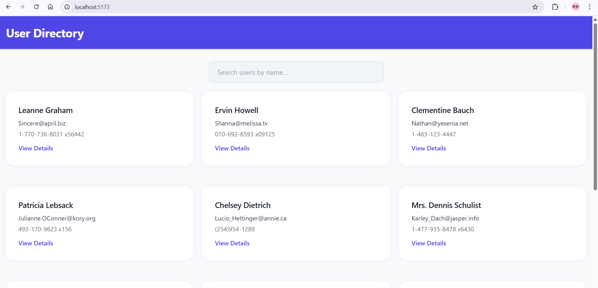
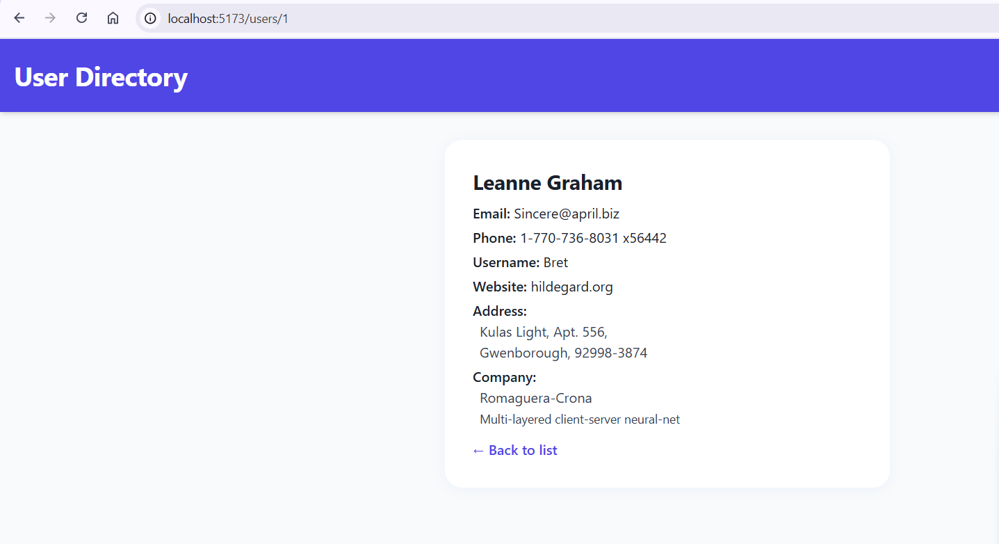
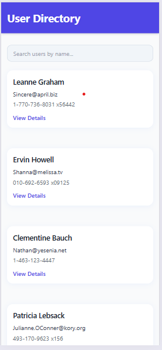

# User Directory | Répertoire d'utilisateurs

## English Version

A React application that displays a user directory with search and details features.

### About the Application

This user directory application provides:
- Real-time user search functionality
- Detailed user profiles
- Responsive design for all devices
- Filter users by various criteria
- Clean and modern UI interface

### Data Source

The application fetches user data from a REST API that provides:
- User basic information (name, username, email)
- Contact details (phone, website)
- Company information
- Address details including geo-coordinates
- All data is retrieved through RESTful endpoints
- Built-in error handling for API requests
- Automatic data refresh mechanisms

### Screenshots


*Main directory view with search functionality*


*Detailed user profile view*


*Responsive mobile interface*

### Prerequisites

- Node.js (version 14.0.0 or higher)
- npm (normally installed with Node.js)

### Installation

1. Clone the repository:
```bash
git clone [https://github.com/G-Bryan237/user-list-react-app]
cd user-directory
```

2. Install dependencies:
```bash
npm install
```

### Running the project

1. To start the development server:
```bash
npm run dev
```

2. Open your browser and navigate to:
```
http://localhost:5173
```

### Available Scripts

- `npm run dev`: Starts the development server
- `npm run build`: Builds the project for production
- `npm run preview`: Preview the production build
- `npm run lint`: Run ESLint

### Technologies Used

- React
- Vite
- React Router
- Tailwind CSS

## Version Française

Une application React qui affiche un répertoire d'utilisateurs avec fonctionnalités de recherche et de détails.

### À propos de l'application

Cette application de répertoire d'utilisateurs propose :
- Recherche d'utilisateurs en temps réel
- Profils utilisateurs détaillés
- Design adaptatif pour tous les appareils
- Filtrage des utilisateurs selon différents critères
- Interface utilisateur moderne et épurée

### Source des données

L'application récupère les données utilisateurs depuis une API REST qui fournit :
- Informations de base des utilisateurs (nom, nom d'utilisateur, email)
- Coordonnées (téléphone, site web)
- Informations sur l'entreprise
- Détails d'adresse incluant les coordonnées géographiques
- Toutes les données sont récupérées via des points d'accès RESTful
- Gestion intégrée des erreurs pour les requêtes API
- Mécanismes de rafraîchissement automatique des données

### Captures d'écran


*Vue principale du répertoire avec fonction de recherche*


*Vue détaillée du profil utilisateur*


*Interface mobile responsive*

### Prérequis

- Node.js (version 14.0.0 ou supérieure)
- npm (normalement installé avec Node.js)

### Installation

1. Clonez le dépôt :
```bash
git clone [https://github.com/G-Bryan237/user-list-react-app]
cd user-directory
```

2. Installez les dépendances :
```bash
npm install
```

### Lancement du projet

1. Pour lancer le serveur de développement :
```bash
npm run dev
```

2. Ouvrez votre navigateur et accédez à :
```
http://localhost:5173
```

### Scripts disponibles

- `npm run dev` : Lance le serveur de développement
- `npm run build` : Compile le projet pour la production
- `npm run preview` : Prévisualise la version de production
- `npm run lint` : Exécute le linter ESLint

### Technologies utilisées

- React
- Vite
- React Router
- Tailwind CSS
